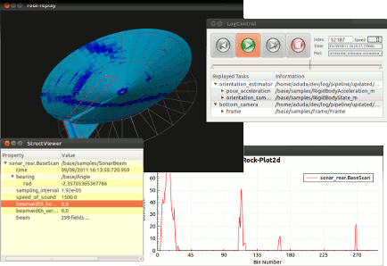
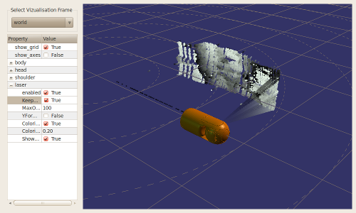

Vizkit
----------------
One important aspect of data analysis is the visualization of data, be it
replayed from logs or live. How data is visualized is usually specific to the
problem, and most likely there is more than one way to show the data and their
relations. Simple values, like robot voltage level, can either be shown
directly or in a time series as a graph. More complex values sometimes also
allow the visualization as a graph or similar. But often, very specific
visualizations are required for complex data types. 

In Rock, the visualization like most other things, also works in a modularized
way. We believe that visualization is very problem specific, and there is no one
size fits all solution. Visualization components are essentially Qt widgets,
than can be connected to data sources and combined in an application specific to
the current problem or project. The aim of the Rock visualization part is to
provide an infrastructure and a collection of visualization components that
require as little as possible additional work to perform the visualization task
at hand. 

2D Visualization
----------------
For the purpose of 2D visualization Rock utilizes the QT-Framework. In particular,
the QT-Widgets. By default Rock provides a set of QT-Widgets that may be used out of
the box for visualizing 2D data. These widgets are called VizkitWidgets. Besides 
their C++ functionality these widgets provide a Ruby binding.

3D Visualization 
----------------

One particularly useful visualization is a 3D view, since it allows to show the
state of the robot's internal view on the world and also often internal states
and how they correlate to the environment model. 

For allowing easy and extendable 3D visualizations, Rock provides a specialized
VizkitWidget the Vizkit3DWidget. The Vizkit3DWidget provides a OpenSceneGraph-Context
and is a container for the Vizkit3DPlugins. Additionally, it offers some utility 
functions, for manipulating the point of view, and adding and removing of plugins.
As any other VizkitWidget it offers ruby binding.

